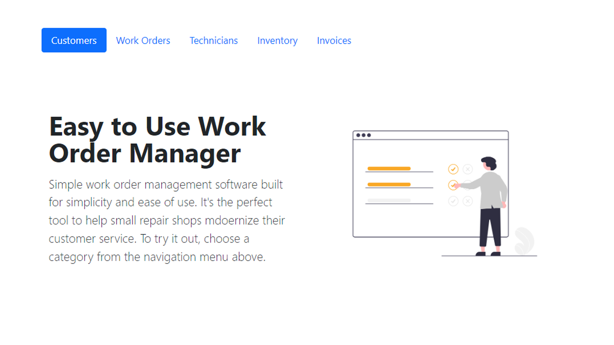

Work Order Tracker visit project here > https://workorderapp.onrender.com/

This is a full-stack web application project is a work order manager/tracker to help small repair shops digitize their work orders so they can provdide a modern customer experience to their clients.

Features:

Create, update, and delete customers and work orders;
View all yard customers and work orders;
When a work order is initiated, the customer will receive an automated email with work order details. When work order status updates to 'Completed', the customer will recieve an automated email with work order and item pick up details.
Page pagination and responsive design for mobile and desktop devices;

Future features:

Registration and login system for administrators
Technicians, Inventory, and Invoices functunality to be completed.

Technologies Used:

Node.js;
Express.js;
MongoDB;
EJS (Embedded JavaScript) for views;
Bootstrap for styling;

